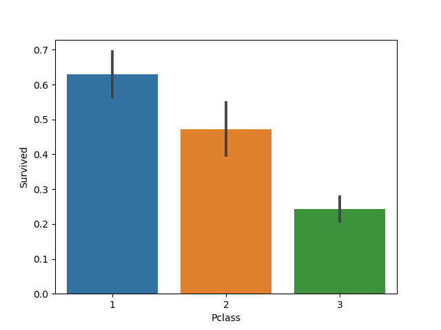

# Titanic Survival Analysis Project 🚢

  
*(Image: RMS Titanic, Public Domain)*

## 📌 Overview
A comprehensive **Exploratory Data Analysis (EDA)** and **data cleaning** project using the iconic Titanic dataset. This project identifies key factors influencing passenger survival rates, leveraging Python's data science stack.

**Key Questions Answered:**
- What was the overall survival rate? 
- How did gender and passenger class affect survival?
- Were children prioritized during rescues?

## 🛠️ Technical Skills Demonstrated
- **Data Cleaning**: Handling missing values (`Age`, `Cabin`, `Embarked`).
- **Feature Engineering**: Creating `Family_Size` and extracting `Title` from names.
- **Statistical Analysis**: Central tendency, dispersion, and correlation metrics.
- **Data Visualization**: Seaborn/Matplotlib plots (histograms, box plots, heatmaps).
- **Machine Learning Prep**: Categorical encoding (label/one-hot) for modeling readiness.

## 🔍 Key Findings
1. **Gender Disparity**:  
   - 74% of females survived vs. 19% of males.
2. **Class Privilege**:  
   - 1st-class passengers had a 63% survival rate vs. 24% for 3rd-class.
3. **Age Matters**:  
   - Children (<10) had a 59% survival rate (vs. 38% overall).

  
*(Survival rates stratified by Pclass and Sex)*

## 📊 Data Sources
Dataset: Kaggle Titanic Competition (https://www.kaggle.com/c/titanic/data)

Tools: Python (Pandas, NumPy, Seaborn, Matplotlib)

## 🤝 Contributing
Open to suggestions! Fork the repo and submit a PR or open an issue.

## 🌟 Connect With Me

